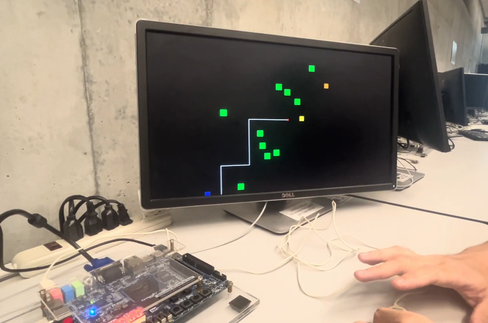
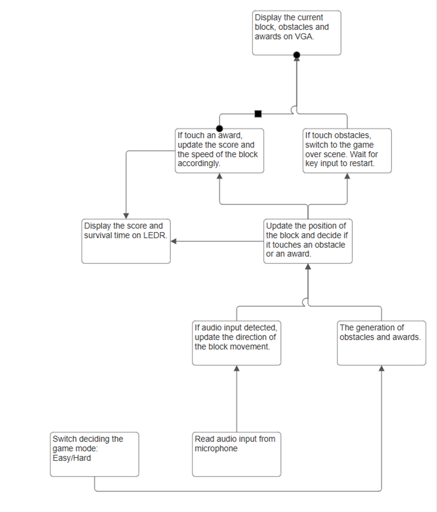

# Wave Dash 🌀

> A real-time, audio-controlled obstacle-avoidance game developed on the DE1-SoC FPGA platform.

---

## 🎮 Overview

**Wave Dash** is a dynamic side-scrolling game where the player's movement is controlled by real-world sound. Built using C and hardware-level access on the DE1-SoC board, the game utilizes:

- 🎤 Audio input via onboard microphone
- 🎨 Real-time VGA rendering with double buffering
- 💡 LED & 7-segment display for score and round tracking
- 🧱 Obstacles and collectibles with particle effects

---

## 🚀 Features

- **Audio-Based Movement**: Clap or make a loud noise to change the direction of the player block.
- **Obstacle Avoidance**: Randomly spawning green blocks must be dodged.
- **Collectibles**:
  - 🔵 **Blue**: Restore normal speed and spawn rate.
  - 🟡 **Yellow**: Increase score and obstacle rate.
  - 🟠 **Orange**: Big score + increased speed.
- **Double Buffering**: Smooth VGA updates without flickering.
- **Difficulty Modes**: SW0 switch selects between simple and difficult modes.
- **Game Over Overlay** and **Pause Menu** using custom text drawing.

---

## 🛠️ How to Run

1. Connect the DE1-SoC board to your computer using **USB Blaster**, and connect its **VGA port** to a monitor.
2. Use the **Intel FPGA Monitor Program** to upload and run your C program on the board .
3. Start the game:
   - Clap or speak loudly to change direction.
   - Avoid green obstacles, collect items.
4. Controls:
   - **KEY0** – Restart the game after game over
   - **KEY1** – Pause/resume
   - **SW0** – Toggle difficulty before starting (simple/difficult)

---

## 📺 Demo Video

👉 [Watch the gameplay demo](https://drive.google.com/file/d/1KNf4FqGeKdWjfi7tjlCCNHac32qWeMXH/view?usp=sharing)

---

## 🧩 Block Diagram

---

## 🧠 System Architecture

- **Input**:
  - Onboard **microphone** for audio amplitude
  - **Keys (KEY0, KEY1)** for restart/pause
  - **Switches (SW0)** for difficulty
- **Processing**:
  - Real-time game logic in C
  - Custom structs for obstacles and collectibles
  - Collision detection and background handling
- **Output**:
  - **VGA buffer** for display
  - **LEDs** for round milestone
  - **7-segment HEX** for time & score

---

## 📁 Code Structure

The game is entirely written in C, using memory-mapped I/O to control:
- VGA buffer
- Audio input FIFO
- Timer interrupts
- LEDs & HEX displays
---

## 👥 Team Members

- Ryan Ren  
- Wayne Wang
---

## 📝 License

This project is licensed under the **MIT License**.  
See the [LICENSE](LICENSE) file for more details.

---

## 🙌 Acknowledgements

We would like to express our sincere gratitude to **Professor Jonathan Rose** of the University of Toronto  
for his exceptional teaching and guidance in ECE243: Computer Organization.  
We also thank the **instructors and TAs** for their support and for providing the DE1-SoC development environment and tools.

